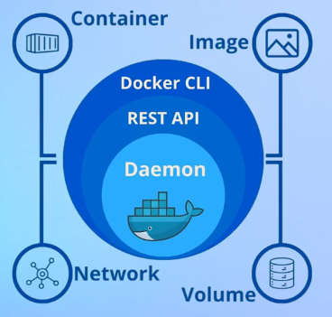

# 1. Fundamentos de Docker

Docker es una herramienta esencial para gestionar y publicar soluciones de software mediante contenedores. La esencia y el punto fuerte de Docker radica en su capacidad de aislar aplicaciones, asegurando que estas funcionen de manera consistente en diferentes sistemas operativos.  

**Características:**

- Empaqueta toda una solución de software.
- Incluye dependencias y configuraciones. 

**¿Cómo funciona?**

    

Esta es la arquitectura básica de Docker.

#### 1. Docker CLI (Capa externa):

+ Se refiere a la interfaz de línea de comandos.
+ Como usuario, se ejecuta los comandos (`docker built`, `docker run`, `docker ps`, etc.).

#### 2. REST API (Interfaz de comunicación):

+ Es la capa que sirve como un traductor entre el CLI y el corazón de Docker en solicitudes HTTP.

#### 3. Docker Daemon:

+ Es el motor central que gestiona todo.
+ Recibe la solicitudes desde la REST API y actúa, por ejemplo, crear contenedores, descargar imágenes, etc.

#### 4. Recursos que administra el daemon:

    1. Container: Es el entorno aislado donde se ejecutan las aplicaciones.
    2. Image: Es la plantilla de solo lectura que define qué software hay en un contenedor.
    3. Network: Cómo se comunican los contenedores entre sí. 
    4. Volume: Es un mecanismo que guarda datos.

**¿Cuál es la diferencia entre una máquina virtual (VM) y un contenedor?**

|Característica|Contenedor Docker|Máquina Virtual|
|-|-|-|
|Virtualiza|Sistema operativo (a nivel de aplicación)|El hardware completo (a nivel del sistema)|
|Ideal para|Microservicios, CI/CD, entornos ligeros|Simular entornos completos (redes con routers, firewalls, etc.), probar múltiples SO|
|Hardware|Hardware real|Sin hardware|
|Necesita|Mantenimiento|Control de versiones|
|Requiere|Software adicional|Sin software adicional|
