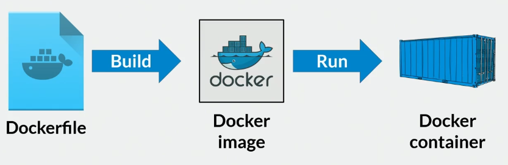

# 1. Fundamentos de Docker

Docker es una herramienta esencial para gestionar y publicar soluciones de software mediante contenedores. La esencia y el punto fuerte de Docker radica en su capacidad de aislar aplicaciones, asegurando que estas funcionen de manera consistente en diferentes sistemas operativos.  

**Características:**

- Empaqueta toda una solución de software.
- Incluye dependencias y configuraciones. 

**¿Cómo funciona?**

Esta es la arquitectura básica de Docker.

#### 1. Docker CLI (Capa externa):

+ Se refiere a la interfaz de línea de comandos.
+ Como usuario, se ejecuta los comandos (`docker built`, `docker run`, `docker ps`, etc.).

#### 2. REST API (Interfaz de comunicación):

+ Es la capa que sirve como un traductor entre el CLI y el corazón de Docker en solicitudes HTTP.

#### 3. Docker Daemon:

+ Es el motor central que gestiona todo.
+ Recibe la solicitudes desde la REST API y actúa, por ejemplo, crear contenedores, descargar imágenes, etc.

#### 4. Recursos que administra el daemon:

    1. Container: Es el entorno aislado donde se ejecutan las aplicaciones.
    2. Image: Es la plantilla de solo lectura que define qué software hay en un contenedor.
    3. Network: Cómo se comunican los contenedores entre sí. 
    4. Volume: Es un mecanismo que guarda datos. Es decir, se conserva los datos almacenados dentro de un contenedor incluso después de que el contenedor se detiene, elimina o reinicia.

**¿Cuál es la diferencia entre una máquina virtual (VM) y un contenedor?**

|Característica|Contenedor Docker|Máquina Virtual|
|-|-|-|
|Virtualiza|Sistema operativo (a nivel de aplicación)|El hardware completo (a nivel del sistema)|
|Ideal para|Microservicios, CI/CD, entornos ligeros|Simular entornos completos (redes con routers, firewalls, etc.), probar múltiples SO|
|Hardware|Sin hardware|Hardware real|
|Necesita|Control de versiones|Mantenimiento|
|Requiere|Sin software adicional|Software adicional|

# 2. Creación de Imágenes con Docker

Lo que sigues es ejecutar el siguiente comando para crear la imagen:

`Docker build .`

Ahora verifiquemos la imagen creada:

`docker images`

Como se pudo notar, no tiene un nombre adecuado. Ahora para eliminar forzadamente, se hace lo siguiente:
`Docker mri -f [IMAGE ID]`

Ahora si ejecutamos el comando asignando un nombre y etiqueta:
`docker build -t sitioweb:latest .`

Vamos a crear el contenedor con:
`docker run -it --rm -d -p 8080:80 --name web sitioweb`

Puede pasar que el puerto que se designe esté ocupado. Para verificar y liberar el puerto, hacemos lo siguiente:
1. ejecutar `netstat -aon | findstr :8080`: 
- `netstat`: muestra el estado de las conexiones de red en la computadora.
- `-a`: Muestra todas las conexiones activas o los puertos en escucha.
- `-o`: Muestra el PID (Process ID) del programa que está usando el puerto.
- `-n`: Muestra direcciones y puertos en formato numérico. 
- `|`: el símbolo pipe envía la salida de `netstat -aon` como entrada de `findstr`.
- `findstr :8080`: este comando solo busca las líneas que contiene el texto `:8080`, es decir, todas las conexiones o puertos en uso que incluyen el puerto 8080. 

2. ejecutar `tasklist | findstr [PID]`:
- `tasklist`: muestra todos los procesos actualmente en ejecución.
- `findstr [PID]`: este comando filtra la salida, mostrando solo las líneas que contengan el PID.

3. ejutar `taskkill /PID [PID] /F`: Sirve para forzar el cierre de un proceso específico.

 

